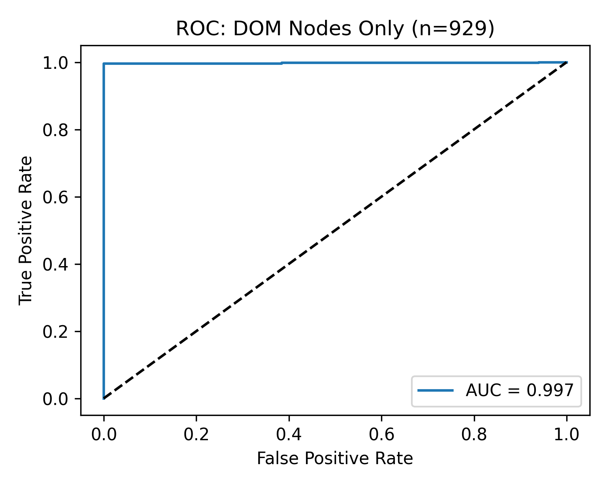

# Document Object Model (DOM) Forensics  
**Zero-Training Detection of Ollama-Generated Web Content**

[](http://creativecommons.org/licenses/by/4.0/)

> **n=929 pages | AUC=0.997 | 1-line browser detector**

---

## Results (n=929)

| Feature       | Real Flipkart (429) | Ollama (500) | **Ratio** |
|---------------|---------------------|--------------|-----------|
| **DOM Nodes** | **1,402.5**         | **52.9**     | **26.5×** |
| Images        | 48.1                | 4.4          | 10.9×     |
| Text Length   | 6,579.8             | 1,319.8      | 5.0×      |

**Threshold: `nodes < 200` → AUC = 0.997**  


---

## 1-Line Detector (Browser)

```js
if (document.querySelectorAll('*').length < 200) 
    alert("DOM Forensics: Ollama Page Detected");
```

---

## Chrome Extension (Live)

**Folder**: `extension/`  
**Files**:
- `manifest.json`
- `detect.js`

**How to test**:
1. Open Chrome → `chrome://extensions`
2. Enable **Developer mode**
3. Click **"Load unpacked"**
4. Select the `extension/` folder
5. Open any `genai/page_*.html` → **Green banner appears**

---

## Dataset

- **Real**: 429 Flipkart product pages (`real/page_*.html`)
- **Synthetic**: 500 Ollama-generated pages (`genai/page_*.html`)
- **Categories**: Mobiles, earphones, kurtis, sarees, pressure cookers

---

## Reproduce in 4 Minutes

```bash
bash run_all.sh
```

**Output**:
- `features.csv` — 929 rows
- `roc.png` — AUC = 0.997

---

## Code

```
.
├── generate_genai.py          # Ollama HTML generation
├── scrape_real_playwright.py  # Flipkart scraping
├── extract_features.py        # DOM node count
├── train.py                   # Threshold + ROC
├── run_all.sh                 # One-click pipeline
├── features.csv               # Final dataset
├── roc.png                    # Result
├── extension/                 # Chrome extension
│   ├── manifest.json
│   └── detect.js
└── requirements.txt
```

---

## Requirements

```txt
playwright
beautifulsoup4
pandas
matplotlib
ollama
```

Install:
```bash
pip install -r requirements.txt
playwright install chromium
```

---# webecho-lite
